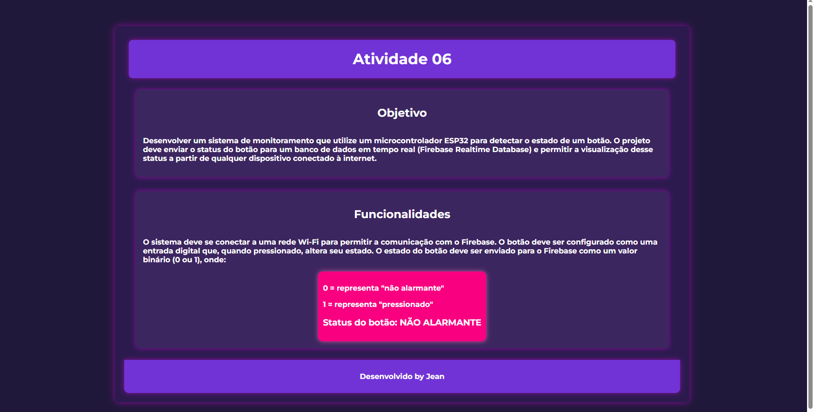

# ATIVIDADE06

Descrição do Projeto
Este projeto consiste em um sistema de monitoramento utilizando um microcontrolador ESP32 para detectar o estado de um botão físico. Quando o botão for pressionado, a informação será enviada em tempo real para um banco de dados Firebase Realtime Database, alterando seu status.

O site exibirá essa informação dinamicamente, refletindo o estado atual do botão, que pode ser:

0 → "Não alarmante" (botão não pressionado)

1 → "Pressionado"

Dessa forma, qualquer usuário conectado à internet poderá visualizar a atualização instantânea do status do botão diretamente na interface web. 🚀

